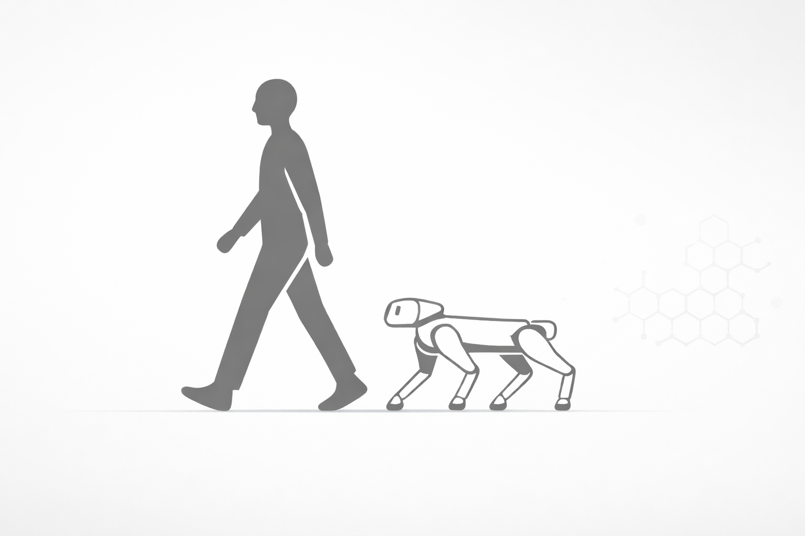

<div align="center">

<p align="center">
  
</p>

# Pedestrian Companion Robot

**Autonomous navigation robot platform built on OpenMind**

[](https://www.python.org/)
[](https://ros.org/)
[](LICENSE)
[](https://openmind.org/)

[Documentation](#documentation) • [Getting Started](#getting-started) • [Contributing](./CONTRIBUTING.md)

---

</div>

## Overview

Pedestrian Companion Robot is an autonomous navigation system built on the OpenMind platform. It enables seamless communication between multimodal AI agents and physical robots, providing GPS-based path planning, obstacle avoidance, and real-time environment perception capabilities.

## Getting Started

### Prerequisites

- Python >= 3.10
- [`uv` package manager](https://docs.astral.sh/uv/getting-started/installation/)
- ROS2 (Humble or Iron) - optional, for autonomous navigation features

### Installation

1. **Clone the repository**
   ```bash
   git clone https://github.com/AI-Robot-SW/openmind-interaction-autonomy.git
   cd openmind-interaction-autonomy
   ```

2. **Install system dependencies (Linux)**
   ```bash
   sudo apt-get update
   sudo apt-get install -y portaudio19-dev python3-dev ffmpeg \
       libasound2-dev libv4l-dev build-essential cmake \
       python3-pip python3-colcon-common-extensions
   ```

3. **Set up the environment**
   ```bash
   uv venv
   source .venv/bin/activate
   uv pip install -e .
   ```
   CycloneDDS and Unitree Go2 Python SDK are included by default. Set the robot network interface in config (e.g. `"unitree_ethernet": "enp2s0"`). Only if you see `Could not locate cyclonedds`, see [unitree_sdk2_python](https://github.com/unitreerobotics/unitree_sdk2_python) for building from source.

4. **Configure OpenMind API key**
   - Obtain an API key from [OpenMind Portal](https://portal.openmind.org/)
   - Replace the `openmind_free` placeholder in `config/<agent-name>.json5`
   - Or create a `.env` file with: `OM_API_KEY=your_api_key`

5. **Run**
   ```bash
   uv run src/run.py <agent-name>
   ```

## Requirements

- **OS**: Ubuntu 22.04 (recommended), macOS 12.0+ (limited support)
- **Python**: >= 3.10
- **GPU**: NVIDIA GPU with CUDA 11.0+ (for GPU-accelerated processing)
- **Hardware**: Intel RealSense camera, Unitree Go2 robot (optional)

Python dependencies are managed via `pyproject.toml`.

## Documentation

- [OpenMind Documentation](https://docs.openmind.org/)
- [ROS2 Documentation](https://docs.ros.org/)
- [Contributing Guide](./CONTRIBUTING.md)

## License

This project is licensed under the MIT License. See [LICENSE](LICENSE) for details.

---

<div align="center">

Built with OpenMind

</div>
